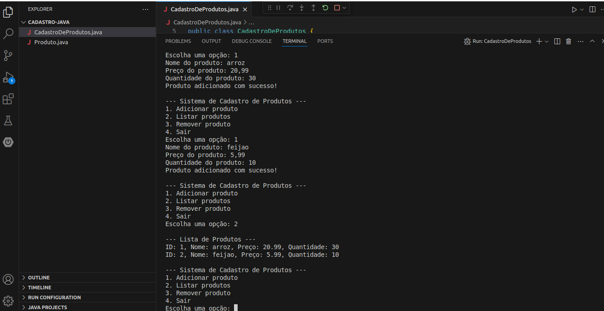

<!DOCTYPE html>
<html lang="pt-br">
<head>
    <meta charset="UTF-8">
    <meta name="viewport" content="width=device-width, initial-scale=1.0">
    <meta name="description" content="Sistema de Cadastro de Produtos em Java">
    <meta name="keywords" content="Java, Cadastro de Produtos, Programação">
    <meta name="author" content="Ana Alice Rodrigues">
</head>
<body>

<header>
    <h1>Sistema de Cadastro de Produtos</h1>
    
</header>

    
Índice

    <ol>
        <li><a href="#sobre-o-projeto">Sobre o projeto</a></li>
        <li><a href="#parte-tecnica">Parte Técnica</a></li>
        <li><a href="#estrutura-dos-arquivos">Estrutura dos Arquivos</a></li>
        <li><a href="#casos-de-uso">Casos de Uso</a></li>
        <li><a href="#ferramentas">Ferramentas</a></li>
        <li><a href="#contato">Contato</a></li>
    </ol>

<section id="sobre-o-projeto">
    <h2>Sobre o projeto</h2>
    

        O "Sistema de Cadastro de Produtos" é uma aplicação em Java que permite ao usuário gerenciar um inventário de produtos. 
        O usuário pode adicionar, listar e remover produtos por meio de um menu interativo exibido no terminal.
    

</section>

<section id="parte-tecnica">
    <h2>Parte Técnica</h2>
    <ul>
        <li><strong>Linguagem:</strong> Java</li>
        <li><strong>IDE:</strong> Visual Studio Code</li>
        <li><strong>Funcionalidades:</strong> 
            <ul>
                <li>Adicionar produtos com nome, preço e quantidade.</li>
                <li>Listar todos os produtos cadastrados com suas informações.</li>
                <li>Remover produtos por ID.</li>
                <li>Gerenciamento de IDs automaticamente incrementados.</li>
            </ul>
        </li>
    </ul>
</section>

<section id="estrutura-dos-arquivos">
    <h2>Estrutura dos Arquivos</h2>
    <ul>
        <li><strong>Produto.java:</strong> Define a estrutura do produto e contém os métodos de acesso e manipulação dos dados de um produto.</li>
        <li><strong>CadastroDeProdutos.java:</strong> Implementa o sistema de cadastro de produtos, incluindo métodos para adicionar, listar e remover produtos.</li>
    </ul>
</section>

<section id="casos-de-uso">
    <h2>Casos de Uso</h2>
    <ul>
        <li><strong>Listar Produtos:</strong> Exibe a lista de produtos cadastrados com ID, nome, preço e quantidade.</li>
        <li><strong>Adicionar Produto:</strong> Permite inserir um novo produto, com nome, preço e quantidade, ao inventário.</li>
        <li><strong>Remover Produto:</strong> Permite remover um produto específico pelo ID fornecido.</li>
        <li><strong>Sair:</strong> Encerra a execução do programa.</li>
    </ul>
</section>

<section id="ferramentas">
    <h2>Ferramentas</h2>
    <ul>
        <li></li>
        <li></li>
        <li></li>
    </ul>
</section>

<section id="contato">
    <h2>Contato</h2>
    <ul>
        <li></li>
    </ul>
</section>

</body>
</html>
